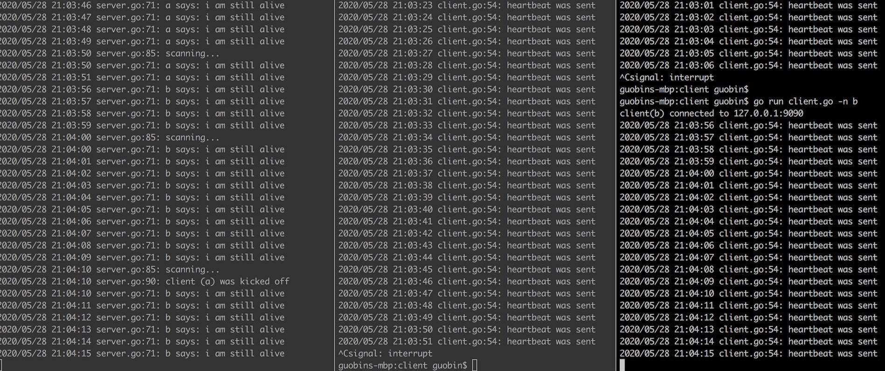

### Theory

对于socket长连接，只要socket建立后不关闭即是长连接，要知道tcp的连接数是有限的，所以关闭是必须的，关键是什么时候关怎么关。

那到底是关客户端socket，还是关服务端socket呢？一般客户端会因为各种原因掉线，所以关服务端是更好的选择。我们可以设定一段时间，当超过这段时间客户端没有任何操作时就去关闭它。

我们让客户端定时（比如每隔5秒）地向服务端发送心跳包，之所以叫心跳包是因为它就像你心脏一样有节律的跳动。为了与普通消息区别开可以附加上一个type属性。

服务端需要维护一个全局心跳列表，简单起见我这里使用map来存，map的key存服务端socket，map的value存最后一次收到来自客户端心跳包的时间戳。服务端线程在每次收到心跳包后就去map里更新一下时间戳。

服务端还需开启另外一个线程，该线程会去定时（比如每隔1分钟）扫描这个全局map，把扫描到的超时（当前时间 - 最后更新时间 > 设定阈值）的socket关闭。

### Run

```
go run server.go
go run client.go -n 客户端名字A
go run client.go -n 客户端名字B
```



### Related Topic

[TCP对话](https://github.com/guobinqiu/tcp-talk)
